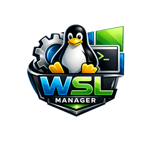

# 🐧 WSL Manager

<div align="center">



**Interface graphique moderne et complète pour gérer WSL (Windows Subsystem for Linux)**

[](https://dotnet.microsoft.com/)
[](https://microsoft.github.io/microsoft-ui-xaml/)
[](https://www.microsoft.com/windows)
[](LICENSE)

*Gérez vos distributions Linux avec style* ✨

[Fonctionnalités](#-fonctionnalités) • [Installation](#-installation) • [Utilisation](#-utilisation) • [Compilation](#-compilation)

</div>

---

## 📋 Table des matières

- [À propos](#-à-propos)
- [Fonctionnalités](#-fonctionnalités)
- [Configuration requise](#-configuration-requise)
- [Installation](#-installation)
- [Utilisation](#-utilisation)
- [Compilation](#-compilation)
- [Architecture](#-architecture)
- [Captures d'écran](#-captures-décran)
- [Contribution](#-contribution)
- [Licence](#-licence)

---

## 🎯 À propos

**WSL Manager** est une application Windows native qui offre une interface graphique complète et moderne pour gérer toutes vos distributions WSL. Plus besoin de mémoriser les commandes en ligne - tout se fait en quelques clics avec une interface élégante basée sur WinUI 3.

### Pourquoi WSL Manager ?

- 🎨 **Design moderne** avec effet Mica et animations fluides
- ⚡ **Fonctionnalités complètes** - Toutes les commandes WSL disponibles
- 🔔 **Notifications intelligentes** pour chaque action
- 📊 **Vue d'ensemble claire** de toutes vos distributions
- 🛠️ **Import/Export** de distributions (TAR et VHD)
- 💾 **Gestion de disques** - Montage et démontage
- 👤 **Multi-utilisateurs** - Terminal avec utilisateur spécifique
- 🔄 **Mise à jour automatique** des packages Linux

---

## ✨ Fonctionnalités

### 📋 Gestion des Distributions

#### Actions de Base
- ✅ **Lister** toutes les distributions avec état en temps réel
- ✅ **Démarrer/Arrêter/Redémarrer** des distributions
- ✅ **Installer** de nouvelles distributions (Microsoft Store ou web)
- ✅ **Supprimer** des distributions (avec confirmation)
- ✅ **Définir par défaut** une distribution
- ✅ **Voir informations** système (`uname -a`)
- ✅ **Mettre à jour packages** (apt, dnf, pacman, etc.)

#### Affichage
- 🟢 **État en temps réel** : Running (vert) ou Stopped (gris)
- 🏷️ **Badge "Par défaut"** pour la distribution principale
- 🔢 **Version WSL** affichée (WSL 1 ou WSL 2)
- 🎨 **Cartes élégantes** avec animations au survol
- 🔔 **Notifications** pour toutes les opérations

### 🔄 Import/Export Avancé

- 📦 **Exporter** en TAR (archive) ou VHD (disque virtuel)
- 📥 **Importer** depuis TAR ou VHD
- 🎯 **Import en place** de VHD sans copie
- ⚙️ **Choisir la version WSL** (1 ou 2) lors de l'import
- 📂 **Emplacement personnalisé** pour les installations
- 💾 **Sélection de fichiers** via explorateur graphique

### 💾 Gestion de Disques

- 🔌 **Monter** des disques physiques ou VHD dans WSL
- 🔓 **Démonter** des disques
- 📊 **Systèmes de fichiers** : ext4, vfat, ntfs, btrfs, xfs
- ⚙️ **Mode bare** pour montage sans partition
- 🔢 **Sélection de partition** spécifique

### ⚙️ Configuration WSL

- 📊 **Afficher l'état WSL** (`wsl --status`)
- 🔍 **Voir la version WSL** installée
- 🔢 **Définir version par défaut** (WSL 1 ou WSL 2)
- 🔄 **Mettre à jour WSL** (options web-download et pre-release)
- 🔀 **Convertir** entre WSL 1 et WSL 2
- 🌐 **Arrêter toutes** les distributions (`wsl --shutdown`)

### 🖥️ Terminal et Explorateur

- 🖥️ **Ouvrir terminal** (Windows Terminal ou cmd)
- 👤 **Terminal avec utilisateur** spécifique
- 🏠 **S'ouvre dans le home Linux** (`~`) automatiquement
- 📁 **Ouvrir explorateur** Windows (`\\wsl.localhost\` ou `\\wsl$\`)
- 🔄 **Glisser-déposer** de fichiers entre Windows et Linux

### 🎨 Installation Avancée

- 📋 **Liste dynamique** des distributions disponibles en ligne
- 🌐 **Web-download** - Télécharger depuis GitHub au lieu du Store
- 🚫 **No-launch** - Ne pas démarrer après installation
- 📂 **Emplacement personnalisé** d'installation
- 📝 **Nom personnalisé** (optionnel)
- ⏳ **Barre de progression** pour installations longues

### 🎨 Interface Utilisateur

- 🪟 **Effet Mica** pour transparence moderne (Windows 11)
- 🌓 **Mode clair/sombre** automatique selon le thème système
- ✨ **Animations fluides** au survol des cartes
- 📊 **Barres de progression** pour opérations longues
- 🔔 **Notifications** : Info, Succès, Avertissement, Erreur
- 📱 **Design responsive** et professionnel
- 🎯 **État vide friendly** avec lien vers la documentation

---

## 💻 Configuration requise

### Système d'exploitation
- **Windows 10** version 19041 (May 2020 Update) ou supérieure
- **Windows 11** (recommandé pour effet Mica)

### Prérequis
- **WSL 2** installé et activé
  ```powershell
  wsl --install
  ```
- **.NET Runtime 8.0** (inclus dans le package self-contained)
- **Windows App SDK** (inclus dans le package)

### Matériel
- **Processeur** : x64 ou ARM64
- **RAM** : 4 GB minimum (8 GB recommandé)
- **Espace disque** : 50 MB pour l'application

---

## 📥 Installation

### Option 1 : Télécharger l'exécutable (Recommandé)

1. Allez dans [Releases](../../releases)
2. Téléchargez `WSL-Manager-vX.X.X.zip`
3. Extrayez le contenu dans un dossier
4. Lancez `WSL Manager.exe`

### Option 2 : Compiler depuis les sources

Voir la section [Compilation](#-compilation) ci-dessous

---

## 🎮 Utilisation

### Démarrage Rapide

1. **Lancer l'application** - Double-cliquez sur `WSL Manager.exe`
2. **Voir vos distributions** - Toutes vos distributions WSL sont affichées
3. **Actions rapides** disponibles sur chaque carte :

| Bouton | Action | Description |
|--------|--------|-------------|
| ▶️ | Démarrer | Lance une distribution arrêtée |
| ⏹️ | Arrêter | Arrête une distribution en cours |
| 🔄 | Redémarrer | Redémarre une distribution |
| 🖥️ | Terminal | Ouvre le terminal dans la distribution |
| 📁 | Explorateur | Ouvre l'explorateur de fichiers Windows |
| ⚙️ | Plus | Menu avec actions avancées |

### Installer une Distribution

1. Cliquez sur **"Installer"** en haut
2. La liste des distributions disponibles se charge automatiquement
3. Sélectionnez une distribution (ex: Ubuntu, Debian, Kali)
4. (Optionnel) Entrez un nom personnalisé
5. (Optionnel) Développez **"Options avancées"** :
   - ☑️ Télécharger depuis le web
   - ☑️ Ne pas lancer après installation
   - 📂 Emplacement personnalisé
6. Cliquez sur **"Installer"**
7. Attendez la fin (barre de progression affichée)

### Importer une Distribution

1. Cliquez sur **"Importer"** en haut
2. Entrez le nom de la distribution
3. Cliquez sur **"Parcourir"** et sélectionnez :
   - Un fichier `.tar`, `.tar.gz` ou `.tgz`
   - Un fichier `.vhd` ou `.vhdx`
4. Choisissez l'emplacement d'installation
5. Sélectionnez **WSL 1** ou **WSL 2**
6. Cliquez sur **"Importer"**

### Exporter une Distribution

1. Cliquez sur **"..."** (Plus d'options) sur une distribution
2. Sélectionnez **"Exporter (avancé)"**
3. Choisissez le format :
   - **TAR Archive** - Fichier compressé portable
   - **VHD** - Disque virtuel
4. Cliquez sur **"Parcourir"** pour choisir l'emplacement
5. Cliquez sur **"Exporter"**

### Mettre à Jour les Packages

1. Cliquez sur **"..."** sur une distribution
2. Sélectionnez **"Mettre à jour les packages"**
3. WSL Manager détecte automatiquement le gestionnaire :
   - Ubuntu/Debian → `apt update && apt upgrade`
   - Fedora/RHEL → `dnf update`
   - Arch → `pacman -Syu`
   - Alpine → `apk update && apk upgrade`
   - openSUSE → `zypper update`

### Menu Avancé

Cliquez sur **"Avancé"** en haut pour :

- 📊 **État WSL** - Informations détaillées WSL
- 🔍 **Version WSL** - Version installée
- 🔢 **Définir version par défaut** - WSL 1 ou 2
- 💾 **Monter un disque** - Disque physique ou VHD
- 🔓 **Démonter un disque** - Retirer un disque monté

### Ouvrir Terminal avec Utilisateur Spécifique

1. Cliquez sur **"..."** sur une distribution
2. Sélectionnez **"Ouvrir terminal (utilisateur)"**
3. Entrez le nom d'utilisateur (ou laissez vide pour défaut)
4. Le terminal s'ouvre dans `/home/utilisateur`

---

## 🔨 Compilation

### Prérequis

- **.NET SDK 8.0** ou supérieur ([Télécharger](https://dotnet.microsoft.com/download))
- **Windows 10 SDK** (inclus avec Visual Studio)
- **Visual Studio 2022** (recommandé) ou VS Code

### Méthode 1 : Ligne de commande

```bash
# Cloner le dépôt (si git)
git clone https://github.com/votre-username/WSL-Manager.git
cd "WSL Manager"

# Restaurer les dépendances
dotnet restore

# Compiler en Debug
dotnet build -c Debug -p:Platform=x64

# Compiler en Release
dotnet build -c Release -p:Platform=x64

# Publier (créer l'exécutable)
dotnet publish -c Release -r win-x64 -p:Platform=x64 --self-contained true -p:PublishReadyToRun=true
```

L'exécutable se trouve dans :
```
bin/Release/net8.0-windows10.0.19041.0/win-x64/publish/WSL Manager.exe
```

### Méthode 2 : Visual Studio

1. Ouvrez `WSL Manager.csproj` dans Visual Studio 2022
2. Sélectionnez **Release** et **x64** en haut
3. Cliquez sur **Générer → Générer la solution** (Ctrl+Shift+B)
4. Pour publier :
   - Clic droit sur le projet → **Publier**
   - Choisissez **Dossier** comme cible
   - Configurez les paramètres
   - Cliquez sur **Publier**

### Méthode 3 : Script automatique

Créez un fichier `build.bat` :

```batch
@echo off
echo ========================================
echo   Compilation de WSL Manager
echo ========================================

echo.
echo [1/3] Restauration des dependances...
dotnet restore

echo.
echo [2/3] Compilation en Release...
dotnet build -c Release -p:Platform=x64

echo.
echo [3/3] Publication (self-contained)...
dotnet publish -c Release -r win-x64 -p:Platform=x64 --self-contained true -p:PublishReadyToRun=true

echo.
echo ========================================
echo   Compilation terminee !
echo ========================================
echo.
echo Executable: bin\Release\net8.0-windows10.0.19041.0\win-x64\publish\WSL Manager.exe
echo.
pause
```

Puis exécutez `build.bat`

### Plateformes supportées

Vous pouvez compiler pour différentes architectures :

```bash
# Pour x64 (Intel/AMD 64-bit)
dotnet publish -c Release -r win-x64 -p:Platform=x64 --self-contained true

# Pour ARM64 (processeurs ARM)
dotnet publish -c Release -r win-arm64 -p:Platform=ARM64 --self-contained true

# Pour x86 (32-bit, legacy)
dotnet publish -c Release -r win-x86 -p:Platform=x86 --self-contained true
```

---

## 🏗️ Architecture

Ce projet utilise le **pattern MVVM** (Model-View-ViewModel) pour une architecture propre et maintenable.

```
WSL Manager/
├── 📁 Models/
│   └── WslDistribution.cs          # Modèle de données d'une distribution
│
├── 📁 ViewModels/
│   ├── ViewModelBase.cs            # Base avec INotifyPropertyChanged
│   └── MainViewModel.cs            # ViewModel principal (16 commandes)
│
├── 📁 Services/
│   ├── WslService.cs               # Service WSL (20+ méthodes)
│   └── NotificationService.cs      # Service de notifications
│
├── 📁 Helpers/
│   ├── RelayCommand.cs             # Implémentation ICommand
│   └── Logger.cs                   # Logging structuré
│
├── 📁 Converters/
│   ├── BoolToVisibilityConverter.cs
│   └── StateToColorConverter.cs
│
├── 📁 Constants/
│   └── AppConstants.cs             # Messages et constantes
│
├── MainWindow.xaml                 # Interface utilisateur
├── MainWindow.xaml.cs              # Code-behind (dialogues)
└── App.xaml                        # Configuration application
```

### Pattern MVVM

**Model** → Données brutes
```csharp
public class WslDistribution
{
    public string Name { get; set; }
    public string State { get; set; }
    public int Version { get; set; }
    public bool IsDefault { get; set; }
    public bool IsRunning => State == "Running";
}
```

**View** → Interface XAML avec binding
```xaml
<ItemsRepeater ItemsSource="{Binding Distributions}">
```

**ViewModel** → Logique métier
```csharp
public ObservableCollection<WslDistribution> Distributions { get; }
public ICommand StartCommand { get; }
public ICommand StopCommand { get; }
// ... 14 autres commandes
```

### Services Principaux

#### WslService.cs - 20+ méthodes

**Gestion de base**
- `GetDistributionsAsync()` - Liste toutes les distributions
- `StartDistributionAsync()` - Démarre une distribution
- `StopDistributionAsync()` - Arrête une distribution
- `RestartDistributionAsync()` - Redémarre
- `SetDefaultDistributionAsync()` - Définit par défaut
- `UnregisterDistributionAsync()` - Supprime
- `ShutdownAllAsync()` - Arrête toutes

**Installation et mise à jour**
- `InstallDistributionAsync()` - Installe (avec options)
- `GetAvailableDistributionsAsync()` - Liste disponibles
- `UpdateDistributionPackagesAsync()` - Met à jour packages
- `UpdateWslAsync()` - Met à jour WSL

**Import/Export**
- `ExportDistributionAsync()` - Exporte TAR ou VHD
- `ImportDistributionAsync()` - Importe avec options
- `ImportDistributionInPlaceAsync()` - Import VHD en place

**Gestion disques**
- `MountDiskAsync()` - Monte disque/VHD
- `UnmountDiskAsync()` - Démonte disque

**Configuration**
- `ConvertWslVersionAsync()` - Convertit WSL 1↔2
- `SetDefaultWslVersionAsync()` - Version par défaut
- `GetWslStatusAsync()` - État WSL
- `GetWslVersionAsync()` - Version WSL

**Terminal et informations**
- `OpenTerminal()` - Ouvre terminal
- `OpenTerminalAsUser()` - Terminal avec utilisateur
- `OpenFileExplorer()` - Ouvre explorateur
- `GetDistributionInfoAsync()` - Infos système

---

## 📸 Captures d'écran

### Interface Principale

*Vue d'ensemble avec plusieurs distributions*

### Installation

*Dialogue d'installation avec options avancées*

### Import/Export

*Import de distribution avec sélection de version WSL*

### Menu Avancé

*Menu avec fonctionnalités avancées*

---

## 🐛 Dépannage

### L'application ne démarre pas
- ✅ Vérifiez que WSL est installé : `wsl --version`
- ✅ Windows 10 19041+ ou Windows 11 requis
- ✅ Installez .NET Runtime 8.0 si message d'erreur

### "Aucune distribution trouvée"
- ✅ Installez une distribution : `wsl --install -d Ubuntu`
- ✅ Cliquez sur "Rafraîchir" après installation

### Erreur lors de l'import
- ✅ Vérifiez que le fichier n'est pas corrompu
- ✅ Essayez avec un emplacement différent
- ✅ Assurez-vous d'avoir l'espace disque nécessaire

### Le terminal ne s'ouvre pas
- ✅ L'application utilise cmd.exe en fallback si Windows Terminal n'est pas installé
- ✅ Installez [Windows Terminal](https://aka.ms/terminal) pour une meilleure expérience

### Erreur de compilation
```bash
# Spécifiez toujours la plateforme
dotnet build -p:Platform=x64

# Ou pour ARM
dotnet build -p:Platform=ARM64
```

---

## 🤝 Contribution

Les contributions sont les bienvenues ! Voici comment contribuer :

1. **Fork** le projet
2. Créez une **branche** (`git checkout -b feature/NouvelleFonctionnalite`)
3. **Committez** (`git commit -m 'Ajout nouvelle fonctionnalité'`)
4. **Push** (`git push origin feature/NouvelleFonctionnalite`)
5. Ouvrez une **Pull Request**

### Guidelines

- ✅ Commentaires XML sur méthodes publiques
- ✅ Gestion d'erreurs complète
- ✅ Tests unitaires si applicable
- ✅ Respect du pattern MVVM
- ✅ Code formaté et propre

---

## 📜 Licence

Ce projet est sous licence **MIT** - voir [LICENSE](LICENSE)

```
MIT License - Copyright (c) 2026 WSL Manager
```

---

## 🙏 Remerciements

- **Microsoft** pour WSL, WinUI 3 et .NET
- **Communauté .NET** pour les ressources
- **Tous les contributeurs** au projet

---

## 📞 Contact & Support

- **Issues** : [GitHub Issues](../../issues)
- **Discussions** : [GitHub Discussions](../../discussions)
- **Documentation WSL** : [Microsoft Learn](https://learn.microsoft.com/windows/wsl/)

---

<div align="center">

**⭐ Mettez une étoile si ce projet vous aide ! ⭐**

Fait avec ❤️ et ☕ par Lucas

[⬆ Retour en haut](#-wsl-manager)

</div>
